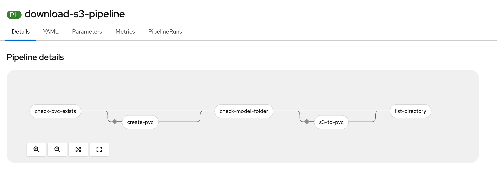

# Tekton S3-to-PVC pipeline

Tekton **Pipeline** and **Tasks** that ensure a model **PersistentVolumeClaim** exists, optionally create it from a JSON template with **`jq`**, check whether the **`models`** folder on the PVC already has content, download from **S3-compatible storage** (including MinIO) when needed, and list the resulting directory.

## Pipeline graph



## What runs, in order

| Task | Purpose |
|------|---------|
| **check-pvc-exists** | If the named PVC is missing in the current namespace, emits `should-create=true`; otherwise `false`. |
| **create-pvc** | Runs only when `should-create=true`. Renders a PVC manifest with **`jq`** and **`oc apply`**. |
| **check-model-folder** | Decides whether to download: empty/missing folder, or **`force_download=true`**, yields `should-download=true`. Logs a status and lists files under the model path. |
| **s3-to-pvc** | Runs only when `should-download=true`. Copies objects under the S3 prefix into **`models/`** on the PVC. Credentials and bucket come from a Kubernetes **Secret** (see `secret-example.yaml` shape). |
| **list-directory** | **`ls`** the **`models`** subpath on the PVC for a quick sanity check. |

Skipped tasks (for example **create-pvc** when the PVC already exists, or **s3-to-pvc** when no download is needed) do not block downstream tasks that list them in **`runAfter`**.

## Prerequisites

- **Tekton Pipelines** installed on the cluster.
- **PipelineRun** (and TaskRuns) use a **ServiceAccount** that can:
  - **`get`** (and optionally **`create`/`patch`**) **PersistentVolumeClaims** in the namespace where the pipeline runs.
  - **`get`/`list`** objects in the S3 **Secret** used by **s3-to-pvc**.
- A **Secret** compatible with **`tasks/s3-to-pvc.yaml`** (keys such as `AWS_ACCESS_KEY_ID`, `AWS_SECRET_ACCESS_KEY`, `AWS_S3_BUCKET`, `AWS_S3_ENDPOINT`, optional `AWS_DEFAULT_REGION`). See **`secret-example.yaml`** as a starting point.
- **create-pvc** uses an image that has **`oc`**, **`jq`**, and (for the check step) **`oc`** only for **check-pvc-exists**; align **`cli-image`** in the tasks with your registry.

## Apply

Apply all **Task** definitions, then the **Pipeline**:

```bash
kubectl apply -k tasks/
kubectl apply -f download-s3-pipeline.yaml
```

Create a **PipelineRun** in the target namespace (set **`pvc-name`**, secrets, workspace bindings if you change the design, etc.). Example parameter surface:

| Parameter | Default | Description |
|-----------|---------|-------------|
| **`pvc-name`** | *(required)* | Name of the PVC used for the model volume. |
| **`pvc-storage-size`** | `10Gi` | Requested size when **create-pvc** creates the claim. |
| **`s3_mode_path`** | `folder-in-bucket` | S3 prefix / folder path to list and download. |
| **`force_download`** | `false` | When `true`, **s3-to-pvc** runs even if **`models`** already has files. |

S3 credentials and bucket in this repo are wired via task params and **`S3_SECRET_NAME`** on the pipeline (currently **`minio`**); adjust to match your Secret name.

## Layout

| Path | Contents |
|------|----------|
| **`download-s3-pipeline.yaml`** | Pipeline **`download-s3-pipeline`**. |
| **`tasks/`** | Reusable Tasks; **`kustomization.yaml`** bundles them for **`kubectl apply -k`**. |
| **`manifests/create-pvc.yaml`** | Comments documenting the JSON shape used by **create-pvc**. |
| **`secret-example.yaml`** | Example OpenShift / Open Data Hub style S3 connection Secret (placeholders only). |
| **`images/pipeline.png`** | Visual overview referenced above. |

## Notes

- **Namespace:** PVC checks and creation target the **PipelineRun namespace** (from the pod service account), not a separate configurable namespace.
- **Endpoints:** S3 endpoints stored as **`s3://...`** in UIs are normalized to **HTTPS** in **s3-to-pvc** for **boto3**.
- **Storage class:** If **create-pvc** should set **`storageClassName`**, extend the **create-pvc** Task params and PipelineRun wiring (not all defaults include it today).
